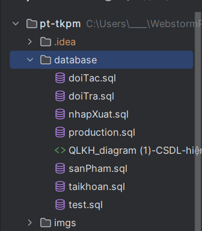
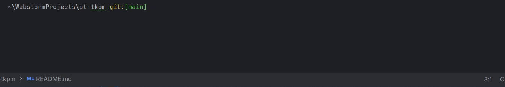
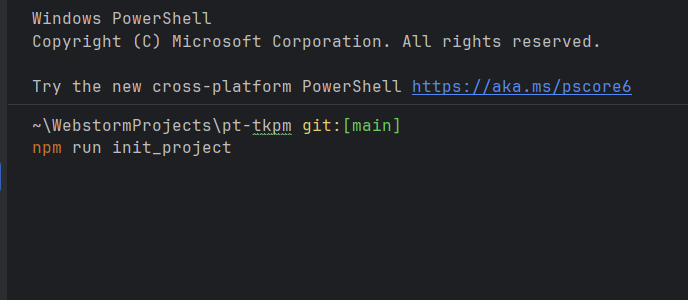
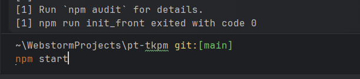

# Hướng dẫn cài đặt
Nếu chưa có nodejs và mysql cài đặt trên máy, hãy cài đặt trước trước khi làm theo hướng dẫn.

Sau khi cài đặt xong mySQL và nodejs, mở workbench ra, truy cập tệp database/production.sql và chạy tệp đó.

Mở terminal đến vị trí tệp muốn cài đặt dự án.

Chạy lệnh `git clone https://github.com/22010176/pt-tkpm.git .`

Sau đó chạy lệnh `npm run init_project`.
Bước này sẽ tải về các tệp dependencies của cả phía client và server về dự án.

Để khởi động, chạy lệnh `npm start`
